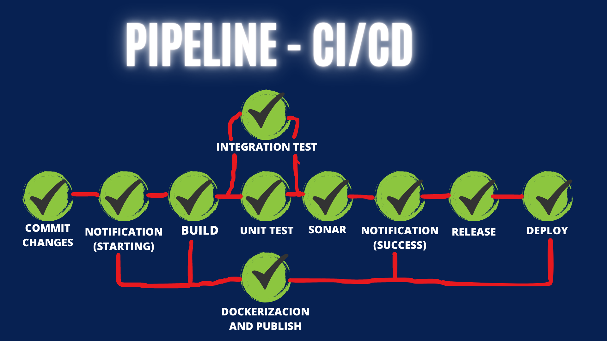

# Restaurant-Backend
[](https://github.com/eiscdev2023/DS2-Restaurant-Backend) [](https://pypi.python.org/pypi/ansicolortags/) 


##About
This is a project developed for the DS2 classes, we've use different tools and strategies related to DevOps philosophy.
This is an a administrations KanBan for a restaurant.

###Built With
-  

-  

- 

-  

- 

- 

- 

- 
-  

##Diseño del Sistema: 


- Control version (git) - git and gitflow as strategy for work flow.
- Build code (build) - Creation and code compilation using diferent tools.
- Unit test - Integration test
- Release - App ready for deployment
- Deploy - release to a production env with vercel

##Getting started
### Installation

_Below are there the steps to be follow in order to install and execute the app._

1. Clone the repo
   ```sh
   git clone https://github.com/eiscdev2023/DS2-Restaurant-Backend.git
   ```
3. Install NPM packages
   ```sh
   npm install
   ```
4. Create an .env file like this.

 ```sh
  PG_HOST='your_host' 
  PG_PORT='5432'
  PG_USER='your_user'
  PG_PASSWORD='your_password'
  PG_DATABASE='your_db'
  PG_POOL_CONNECTION_LIMIT=10 
  PG_POOL_IDLE_TIMEOUT=30000 
```
  
  ##CI/CD
*build.yml - This action run on every push and pull request to the feature_* and develop branches it runs several jobs and a Postgres service use for testing.
- Slack notification (starting): this job send a slack notification of starting execution to a Slack channel. 
- Lint - It runs eslint to check if there are any linting errors.
- Test - It runs the unit and integration tests using jest.
- Sonar - It runs SonarCloud analysis. This uses SonarCloud to analyze the code and find bugs, vulnerabilities, code smells, etc
- Slack notification (succes): this job send a slack notification of succes execution to a Slack channel. 

*main.yml - This action run on every push and pull request to the main branch it runs several jobs.
- Slack notification (starting): this job send a slack notification of starting execution to a Slack channel. 
- Deploy: ...
- Docker: This job create a docker image of the project and publish it on docker_hub.